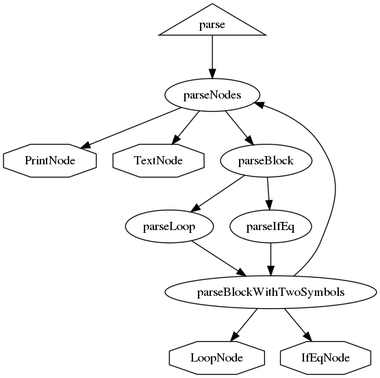
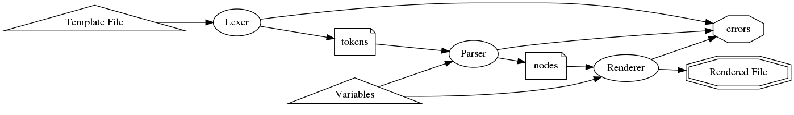
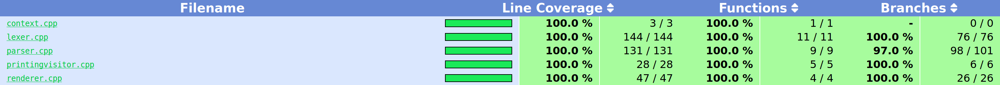

# carender - car template renderer

`carender` renders a `car` template with provided variables to create a text output.

## Quick Start

On a system that can run binaries built on `debian:stretch`, run the following commands to see a rendered template:
```sh
./build_in_docker.sh
cd from_docker/bin
RANGE_SYMBOLS=../../examples/fruits/ranges.txt SYMBOLS=../../examples/fruits/symbols.txt ./carender ../../examples/fruits/template.car
```

## Design

### Requirements
* No third-party library dependencies except libc/libc++/STL.
* No lexer/parser generators.
* Target C++14 standard.
* Having fun throughout the development process.

### Principles

OOP design patterns, SOLID and DRY principles are observed as far as possible in the limited time that was allocated to this project. That is, except `test` and `cmd` folders. There is a lot of code duplication in `tests` and there are no tests in `cmd`.

### Decisions

* No unused code.
* No commented-out code.
* Target recent g++ and clang++ versions.
* Target 100% unit test **branch** coverage.
* There are two types of template symbols, string (`Renderer::symbols`) and strings (`Renderer::rangeSymbols`).

## Implementation

`carender` consists of a lexer, a parser, a renderer and a command line tool that uses these components as an example.

**Lexer** reads an `istream` and ignores whitespace in non-text context, e.g. between START_DIRECTIVE and START_BLOCK in `{{   #loop range element}}`. Inside text content, lexer does not ignore whitespace. For this purpose, lexer keeps track of the state as "inside START_DIRECTIVE or not" and "inside START_BLOCK/END_BLOCK or not".

Entry point is the public `lex` method:
```c++
bool lex(std::istream &input, std::vector<Token> &output, std::ostream &error);
```

**Parser** is a hand-written recursive-descent parser that generates four types of nodes:
`TextNode`, `PrintNode`, `LoopNode`, `IfEqNode`.

Entry point is the public `parse` method:

```c++
std::vector<std::unique_ptr<Node>> parse(const std::vector<Token> &tokens, std::ostream &error)
```


Simplified `Parser` method call graph:



Notes:
* `parseBlock` method choses the parser method to dispatch for a block based on the keyword (`loop` and `ifeq`) from the `keywordParser` map defined in the `Parser`.
* To reduce code duplication, common functionality of `parseLoop` and `parseIfEq` are moved to the template member method, `parseBlockWithTwoSymbols`.
* Parser is tested with the Lexer's output and separately with manually crafted Token streams that the lexer may not generate, in `test_parser.cpp`.

**Renderer** implements the `Visitor Pattern` to consume a stream of nodes from the parser.

Entry point is the public `visit` methods called from the `accept` methods on nodes:

```c++
node->accept(renderer);
```

Data flow using `lexer`, `parser` and `renderer`:



### Building

`make all`

A [Makefile](Makefile) is used for building, testing and coverage reporting.

`make` targets:

* `lib`: To build the static library.
* `test`: To build unit tests.
* `cmd`: To build example command-line tool.
* `clean`: Remove build artifacts.
* `cover`: Build unit tests with coverage instrumentation, run tests to collect coverage information and create html reports in `test_coverage` folder.
* `cover-show`: Build `cover` and display index with `firefox`.

Set `CXX` environment variable to use a different compiler. Tested with recent clang++, afl-g++, afl-clang++ versions.

### Testing

`make test && bin/test`

* [catch2](https://github.com/catchorg/Catch2) chosen for unit testing. It is a header-only library and easy to add to a project.

### Coverage

`make cover`

* `g++` and [lcov](http://ltp.sourceforge.net/coverage/lcov.php) for coverage reports. Coverage reporting is not supported when building with `clang++`.
* To increase branch coverage, compiler-generated unreachable destructor branches are excluded with `LCOV_EXCL_START` and `LCOV_EXCL_STOP` markers.
  * Related: ["G++ emits two copies of constructors and destructors."](https://gcc.gnu.org/bugs/#nonbugs_cxx) and [What is the branch in the destructor reported by gcov?](https://stackoverflow.com/a/7199706/128002).



## Usage

`carender` can be linked as a static library. A command line tool is provided as an example of using the library.

**Warning:** Only tested on Ubuntu 18.04 and Debian Stretch.

* A `Dockerfile` added to document the build steps in a reproducible manner. Run `build_in_docker.sh` to build, test and create coverage reports.

### High-level Driver API

Driver API is designed to be batteries-included, for consumers that do not want to configure subcomponents (`lexer`, `parser`, `renderer`) separately.

```c++
#include "driver.hpp"
#include <fstream>

// symbols and rangeSymbols are unordered_map instances defining valid symbols and their values for the template.
auto driver = car::driver::Driver(symbols, rangeSymbols, std::cout, std::cerr);
auto templ = std::ifstream("template.car");

if(driver.Render(templ)) {
    // We have the template rendered to the `output` stream, `std::cout` in this case.
    return;
}
// There were some errors, they are written to the `error` stream, `std::cerr` in this case.
```

See the sample application for an example usage of the Driver API at [main.cpp](cmd/main.cpp)

### Low-level API

Low-level API allows for configuration of the subcomponents. New options may be added in new versions.

#### Lexer

`Lexer` consumes an input stream and emits a stream of tokens as a `std::vector<car::lexer::Token>`. See [test_lexer.cpp](test/test_lexer.cpp) and [driver.cpp](cmd/driver.cpp) for usage examples.

```c++
auto lexer = car::lexer::Lexer();
auto tokens = std::vector<car::lexer::Token>();

lexer.lex(input, tokens, error);
```

#### Parser

`Parser` consumes a token stream and emits a stream of nodes as a `std::vector<std::unique_ptr<Node>>`. See [test_parser.cpp](test/test_parser.cpp) and [driver.cpp](cmd/driver.cpp) for usage examples.

```c++
auto options = ParserOptions(symbolNames);
auto parser = Parser(options);

auto nodes = parser.parse(tokens, error);
```

#### Renderer

`Renderer` consumes a node stream and emits text. See [test_renderer.cpp](test/test_renderer.cpp) and [driver.cpp](cmd/driver.cpp) for usage examples.

```c++
auto renderer = Renderer(symbols, rangeSymbols, output, error);
for (auto const &n : nodes)
{
    n->accept(renderer);
}
```

# `car` template language

## An example to get a taste:

### Template
```
Hello {{name}},

{{#loop items item}}
I like {{item}}{{#ifeq item favorite}} very much{{/ifeq}}.
{{/loop}}

Cheers!
```

### Variables
```
name: "Donald"
items: ["apples", "pineapples", "oranges"]
favorite: "pineapples"
```

### Rendered output
```
Hello Donald,

I like apples.
I like pineapplesvery much.
I like oranges.

Cheers!
```

## Grammar
In an approximate E-BNF:
```
TEMPLATE = TEXT | PRINT | LOOP | IFEQ

CHILDREN = TEMPLATE

START_DIRECTIVE = "{{"
END_DIRECTIVE = "}}"
START_BLOCK = "#"
END_BLOCK = "/"
SYMBOL = TEXT

TEXT = a string not containing START_DIRECTIVE

PRINT = START_DIRECTIVE, SYMBOL, END_DIRECTIVE

LOOP = START_DIRECTIVE, START_BLOCK, "loop", END_DIRECTIVE, CHILDREN, START_DIRECTIVE, END_BLOCK, "loop", END_DIRECTIVE

IFEQ = START_DIRECTIVE, START_BLOCK, "ifeq", END_DIRECTIVE, CHILDREN, START_DIRECTIVE, END_BLOCK, "ifeq", END_DIRECTIVE
```